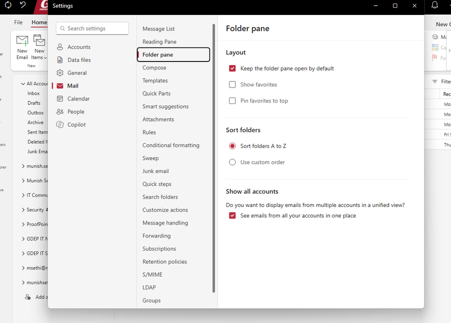
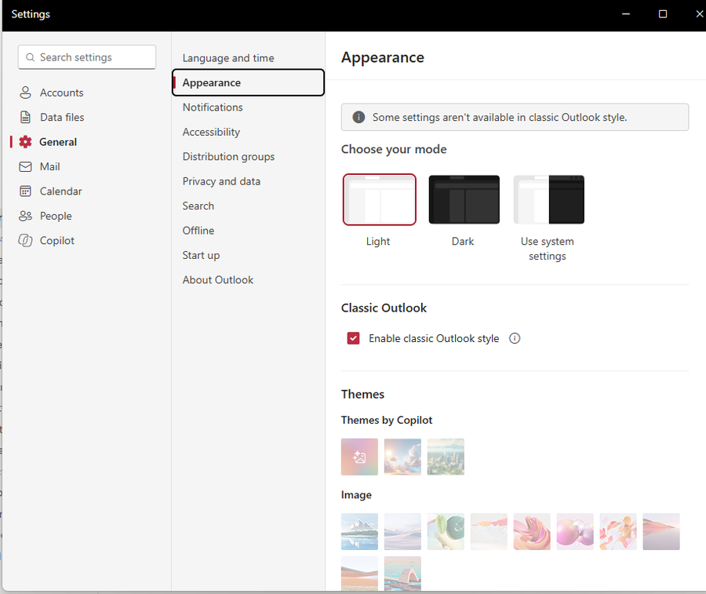

# New Outlook for Windows: The All Accounts View (and a Classic Outlook Style)
## Is It Time to Revisit the Switch?

---

If you have been holding off on new Outlook for Windows, two recent changes are worth a second look:

- **All Accounts view** - a single, combined Inbox, Drafts, Sent Items, etc. across every account added to Outlook. This is a long-overdue feature, and one classic Outlook for Windows never had
- **Classic Outlook style** - an optional setting that makes new Outlook look and behave much closer to classic Outlook, which removes the most common complaint about switching

This article starts with the All Accounts view, because for anyone juggling more than one mailbox it is the most practical improvement new Outlook has shipped. It then covers how to get the Classic Outlook style early using Targeted Release, and what it looks like once enabled.

---

## The All Accounts View

### Why It Matters

If you are like me, you have more than one email account: a couple of Microsoft 365 work accounts, a personal Outlook.com address, and a Gmail account or two. In classic Outlook, each of those is its own folder tree. Checking mail means clicking into one Inbox, then the next, then the next - and it is easy to miss something sitting in an account you did not look at.

New Outlook now solves this with an **All Accounts** node at the top of the folder pane. It gives you a single **Inbox, Drafts, Outbox, Archive, Sent Items, Deleted Items,** and **Junk Email** covering every account you have added. You can read, reply, delete, move, and archive messages from that one view, while each account stays a separate mailbox underneath - nothing is merged or copied.

In practice this has changed how I use Outlook day to day: one Inbox to triage in the morning instead of five.

### Classic Outlook Never Had This

Classic Outlook for Windows has never had a true unified inbox. Outlook for Mac and the Outlook mobile apps have offered one for years, but on Windows the options were all workarounds:

- **Favorites** - pin each account's Inbox to Favorites so they sit together at the top of the folder pane, but you still open them one at a time
- **Search scope** - change the search scope to *All Mailboxes* and search for something like `received:this week`, which gives a temporary combined list rather than a folder
- **Search folders** - build a custom search folder to collect mail across accounts
- **Rules** - copy incoming mail from every account into one central folder, at the cost of duplicate messages, extra storage, and read status that no longer matches between the copies

None of these behave like a real combined Inbox. The All Accounts view in new Outlook does, with no setup at all.

### Turning It On (or Off)

The All Accounts view is **enabled by default** as it rolls out. If you do not see it, or want to turn it off:

1. Open **Settings > Mail > Folder pane**
2. Under **Show all accounts**, check (or uncheck) **See emails from all your accounts in one place**

### Current Limitations

From my testing and Microsoft's notes on the rollout:

- It works with **every account added to Outlook**, including multiple Microsoft 365 work accounts and external accounts such as Outlook.com and Gmail
- It does **not** include **shared or delegated mailboxes** - those still appear as their own folder trees. Microsoft has said shared mailbox support will come later
- **Search** from the All Accounts view currently only covers the **primary account**. Cross-account search is also planned for a later update

**Tip:** On the same *Folder pane* page, **Sort folders > Use custom order** lets you arrange folders in any order you like. Classic Outlook always sorted subfolders alphabetically, so this is another thing new Outlook now does better.

---

## The Classic Outlook Style

The All Accounts view is a reason to move *to* new Outlook. The Classic Outlook style removes one of the main reasons people stay *away* from it. In my experience, the unfamiliar look, spacing, and navigation have kept more users on classic Outlook than any missing feature.

### What It Is

The Classic Outlook style is a per-user setting in **new Outlook for Windows** and **Outlook on the web**. Per Microsoft's Message Center post **MC1458476**, it changes the **visual styling, layout, typography, icons, and selected interactions** so the client more closely resembles classic Outlook.

Key points:

- It is **cosmetic only** - no mailbox data, permissions, or functionality changes
- It is **off by default** for most users, although Microsoft may turn it on automatically for some users moving from classic Outlook
- At the time of writing there is **no admin control** to force it on or lock it - it is a user preference
- It does **not** migrate anyone from classic Outlook to new Outlook, and it does not override any existing admin settings controlling new Outlook availability
- Rollout timeline:
    - **Targeted Release:** mid-August to late September 2026
    - **General Availability:** late September to late October 2026

If your tenant is on **Standard Release**, you may not see the setting yet. The next step shows how to get it sooner for a few users.

### Step 1: Enable Targeted Release for Select Users

If you open **Settings > General > Appearance** in new Outlook and there is no **Classic Outlook** section, your mailbox has not received the feature yet. Note that the older **Classic themes** drop-down on the same page is *not* this feature - it only offers the legacy color themes.

To get early access without changing anything for the rest of the organization, put yourself (or a small pilot group) on Targeted Release:

1. Sign in to the **Microsoft 365 admin center**
2. Go to **Settings > Org settings**
3. Select the **Organization profile** tab
4. Open **Release preferences**
5. Change the option from **Standard release** to **Targeted release for select users**
6. Add your own account (or your pilot users) and **Save**

**How long to wait:** Microsoft says release preference changes can take up to 24 hours to take effect. In my case, the Classic Outlook option appeared in new Outlook about **4-5 hours** after the switch.

> **Note:** Targeted Release users get *all* Microsoft 365 changes early, not just this one. That is usually a good thing for IT staff who want to see changes before end users do, but keep the pilot group small and deliberate.

### Step 2: Turn On the Classic Outlook Style

Once the feature reaches your mailbox:

1. Open **new Outlook for Windows**
2. Select the **gear icon** (Settings)
3. Go to **General > Appearance**
4. Under the **Classic Outlook** section, check **Enable classic Outlook style**

What I noticed after enabling it:

- It is a **checkbox**, not a toggle, in its own **Classic Outlook** section between *Choose your mode* and *Themes*
- A banner appears at the top of the page: *"Some settings aren't available in classic Outlook style."* Microsoft does not say which settings, but in practice the **Themes** section (**Themes by Copilot**, **Image**, and **Color**) is greyed out. Light, Dark, and system mode still work
- A **File** tab is back on the ribbon
- The **Mail** settings are reorganized into sections that will look familiar to classic Outlook users, such as *Message List*, *Reading Pane*, *Folder pane*, *Templates*, *Quick Parts*, *Conditional formatting*, *Search folders*, and *Quick steps*

### Optional: Complete the Classic Look

The Classic Outlook style does most of the work, but these settings bring new Outlook even closer to the classic experience:

| Setting | Where to Find It | Recommended Value |
|---|---|---|
| Ribbon | Arrow (⌄) at the far right of the ribbon | **Classic ribbon** |
| Density | Settings > General > Appearance | **Compact** |
| Reading pane | View > Layout > Reading pane | **Show on the right** |
| Conversations | View > Conversations | **Don't group messages** |
| Message preview | Settings > Mail > Message List (*Layout* if classic style is off) | **Hide preview text** |
| Focused Inbox | Settings > Mail > Message List (*Layout* if classic style is off) | **Don't sort my messages** |
| Keyboard shortcuts | Settings > General > Accessibility | **Outlook for Windows** |

Menu locations move between builds, so if an option is not where you expect it, use the **Search settings** box at the top of the Settings window.

---

## Conclusion

The **All Accounts** view is the feature that finally makes new Outlook better than classic Outlook for anyone working across several mailboxes - multiple work tenants, Outlook.com, Gmail - and it is something classic Outlook never offered. The **Classic Outlook style** then takes away most of the friction of the switch itself. Together, they make new Outlook worth another look.

**Summary:**

| Item | Details |
|---|---|
| All Accounts view | **Settings > Mail > Folder pane** - on by default; combines all added accounts, but not shared or delegated mailboxes (yet) |
| Classic Outlook | Never had a unified inbox - only workarounds (Favorites, search, search folders, rules) |
| Classic Outlook style | Per-user, cosmetic setting under **Settings > General > Appearance** |
| Availability | GA expected to complete by late October 2026; use **Targeted release for select users** to get it earlier for a pilot group |
| Side effect | Image and color **Themes** are unavailable while the Classic Outlook style is enabled |

---

## References

* [Unified Inbox in the new Outlook for Windows (Topedia)](https://blog-en.topedia.com/2026/09/unified-inbox-in-the-new-outlook-for-windows/)
* [MC1458476 - Classic Outlook theme experience for Outlook on the web and Outlook for Windows](https://mc.merill.net/message/MC1458476)
* [Set up the Standard or Targeted release options in Microsoft 365](https://learn.microsoft.com/en-us/microsoft-365/admin/manage/release-options-in-office-365)

---

*Screenshots and settings reflect new Outlook for Windows as of September 2026. Microsoft updates new Outlook frequently, so menu names and locations may change. Test in your own environment before rolling changes out broadly.*
