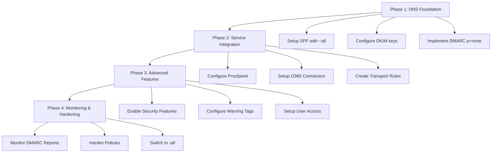

# 📧 Email Security Implementation (O365 and Proof Point Essentials) Series
## Part 1: Understanding SPF, DKIM, and DMARC Fundamentals

---

### 📚 **Series Navigation**
- **Part 1: Understanding SPF, DKIM, and DMARC** *(Current)*
- [Part 2: DNS Configuration and Setup](email-o365-proofpoint-part2.md)
- [Part 3: Office 365 Connector Configuration](email-o365-proofpoint-part3.md)
- [Part 4: Proofpoint Integration Setup](email-o365-proofpoint-part4.md)
- [Part 5: Testing and Troubleshooting](email-o365-proofpoint-part5.md)

---

## 🎯 **What You'll Learn**

By the end of this series, you'll have a complete understanding of how to implement enterprise-grade email security using SPF, DKIM, DMARC, and integrate Office 365 with Proofpoint Essentials for comprehensive email protection.

---

## 🔐 **Understanding Email Authentication Protocols**

Email security is critical in today's threat landscape. Without proper authentication, your domain can be spoofed, your users can receive malicious emails, and your organization's reputation can be damaged. Let's dive into the three pillars of email authentication.

### **SPF (Sender Policy Framework)**

#### What is SPF?
SPF is like a **guest list** for your email domain. It tells receiving email servers which IP addresses and mail servers are authorized to send emails on behalf of your domain.

#### Why SPF Matters:
- ✅ **Prevents Domain Spoofing**: Stops bad actors from sending emails that appear to come from your domain
- ✅ **Improves Deliverability**: Legitimate emails are more likely to reach the inbox
- ✅ **Reduces Spam**: Helps email providers identify and block fraudulent emails

#### How SPF Works:
1. You publish an SPF record in your DNS
2. When someone receives an email claiming to be from your domain, their email server checks your SPF record
3. If the sending server's IP is in your SPF record → ✅ **PASS**
4. If the sending server's IP is NOT in your SPF record → ❌ **FAIL**

---

### **DKIM (DomainKeys Identified Mail)**

#### What is DKIM?
DKIM is like a **digital signature** for your emails. It uses cryptographic signatures to verify that an email actually came from your domain and hasn't been tampered with during transit.

#### Why DKIM Matters:
- ✅ **Email Integrity**: Ensures emails haven't been modified in transit
- ✅ **Authentication**: Proves the email really came from your domain
- ✅ **Trust Building**: Increases recipient confidence in your emails

#### How DKIM Works:
1. Your email server signs outgoing emails with a private key
2. You publish the corresponding public key in your DNS
3. Receiving servers use the public key to verify the signature
4. If signature matches → ✅ **PASS** | If not → ❌ **FAIL**

---

### **DMARC (Domain-based Message Authentication, Reporting & Conformance)**

#### What is DMARC?
DMARC is the **policy enforcer** that tells receiving email servers what to do when SPF or DKIM checks fail. It also provides valuable reporting on email authentication results.

#### Why DMARC Matters:
- ✅ **Policy Enforcement**: Actively blocks fraudulent emails
- ✅ **Visibility**: Provides reports on who's sending emails using your domain
- ✅ **Gradual Implementation**: Allows you to monitor before enforcing

#### DMARC Policies:
- **`p=none`**: Monitor only (recommended for initial setup)
- **`p=quarantine`**: Send suspicious emails to spam folder
- **`p=reject`**: Completely block suspicious emails

---

## 🏗️ **Implementation Strategy Overview**

### **The Logical Implementation Order**

### **Why This Order Matters**

1. **Start Soft, Finish Hard**: Begin with monitoring (`~all`, `p=none`) before enforcing hard policies
2. **Foundation First**: DNS records must be in place before services can use them
3. **Test Everything**: Each phase includes testing before moving to the next
4. **Minimize Disruption**: Gradual implementation reduces the risk of blocking legitimate emails

---

## ⚠️ **Important Considerations Before Starting**

### **Planning Phase**
- 📋 **Document Current Setup**: Know your existing mail flow
- 🕒 **Plan Maintenance Window**: Some changes may briefly affect mail delivery
- 🔄 **Prepare Rollback Plan**: Know how to quickly revert changes if needed
- 👥 **Stakeholder Communication**: Inform users about potential temporary issues

### **Common Pitfalls to Avoid**
- ❌ **Don't start with hard policies** (`-all`, `p=reject`)
- ❌ **Don't skip testing phases**
- ❌ **Don't implement everything at once**
- ❌ **Don't ignore DMARC reports**

---

## 🎯 **What's Next**

In **Part 2**, we'll dive into the actual DNS configuration, including:
- Setting up SPF records with proper syntax
- Handling SPF character limits with multiple records
- Configuring DKIM keys from multiple sources
- Implementing DMARC with proper reporting

---

### 📖 **Series Navigation**
- **Part 1: Understanding SPF, DKIM, and DMARC** *(Current)*
- [Part 2: DNS Configuration and Setup →](email-o365-proofpoint-part2.md)

---

*This series covers enterprise-level email security implementation. Always test in a non-production environment first and have a rollback plan ready.*