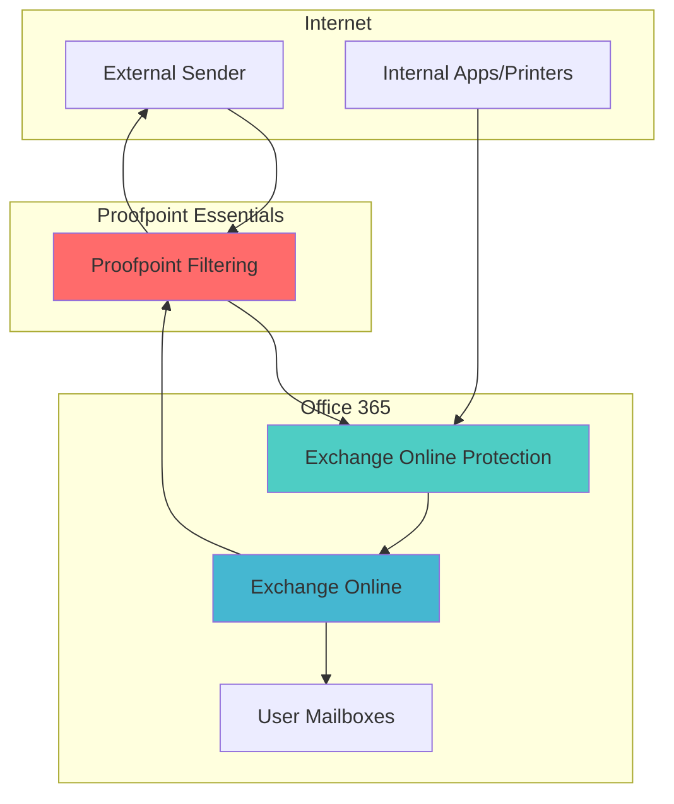

# 📧 Email Security Implementation (O365 and Proof Point Essentials) Series
## Part 3: Office 365 Connector Configuration

---

### 📚 **Series Navigation**
- [Part 1: Understanding SPF, DKIM, and DMARC](email-o365-proofpoint-part1.md)
- [Part 2: DNS Configuration and Setup](email-o365-proofpoint-part2.md)
- **Part 3: Office 365 Connector Configuration** *(Current)*
- [Part 4: Proofpoint Integration Setup](email-o365-proofpoint-part4.md)
- [Part 5: Testing and Troubleshooting](email-o365-proofpoint-part5.md)

---

## 🎯 **What We'll Configure**

In this part, we'll set up three critical Office 365 connectors and a transport rule:
1. **Proofpoint Inbound Connector** - Receives filtered email from Proofpoint
2. **ProofPoint Outbound Connector** - Sends outbound email through Proofpoint
3. **SMTP Relay Connector** - Allows internal systems to send email
4. **ProofPoint Spam Bypass Rule** - Prevents double-scanning of emails

---

## 🔄 **Mail Flow Architecture**

Understanding the mail flow is crucial before configuration:



---

## 🔑 **Prerequisites**

Before starting, ensure you have:
- [ ] Global Administrator access to Office 365
- [ ] Exchange Online Administrator permissions
- [ ] DNS records from Part 2 implemented and propagated
- [ ] Proofpoint IP address ranges (from Proofpoint documentation)

---

## 📥 **Connector 1: Proofpoint Inbound**

This connector accepts filtered email from Proofpoint and is the most security-critical configuration.

### **Step 1: Create the Inbound Connector**

1. **Navigate to Exchange Admin Center**
   - Go to [admin.exchange.microsoft.com](https://admin.exchange.microsoft.com)
   - Sign in with Global Admin credentials

2. **Access Mail Flow Settings**
   - Click **Mail flow** in the left navigation
   - Select **Connectors**
   - Click **+ Add a connector**

3. **Configure Basic Settings**
   ```
   Connection from: Partner organization
   Connection to: Office 365
   Name: Proofpoint Inbound connector
   Description: Receives filtered email from Proofpoint Essentials
   ```

### **Step 2: Configure Partner Organization Identity**

```
How to identify your partner organization:
☑️ By verifying that messages are coming from these domains: *
```

> **Why use asterisk (*)**: We want to accept email for ALL domains that might be processed by Proofpoint, not just our primary domain.

### **Step 3: Configure Security Restrictions**

#### **TLS Requirements:**
```
☑️ Reject messages if they aren't encrypted using Transport Layer Security (TLS)
```

#### **IP Address Restrictions:**
```
☑️ Reject messages if they don't come from within these IP address ranges:
67.231.149.0/24
67.231.148.0/24  
67.231.147.0/24
67.231.146.0/24
67.231.145.0/24
67.231.144.0/24
67.231.156.0/24
```

> **⚠️ Critical Security Note**: Include ALL Proofpoint IP ranges from their documentation. The security of your email depends on this being complete and accurate.

### **Step 4: Apply Advanced Security Setting**

After creating the connector, run this PowerShell command to prevent bypass attacks:

```powershell
# Connect to Exchange Online PowerShell
Connect-ExchangeOnline

# Enable the critical security setting
Set-InboundConnector -Identity "Proofpoint Inbound connector" -RestrictDomainsToIPAddresses $True

# Verify the change was applied successfully
Get-InboundConnector -Identity "Proofpoint Inbound connector" | Select-Object Name, RestrictDomainsToIPAddresses
```

#### **Why This Setting Matters:**
- **Without it**: Bad actors can send emails directly to your O365 endpoints, bypassing Proofpoint
- **With it**: Only emails from Proofpoint IP ranges are accepted, forcing all email through your security stack
- **The Risk**: It's easy for attackers to discover if an organization uses O365 and target the endpoints directly

---

## 📤 **Connector 2: ProofPoint Outbound**

This connector routes all outbound email through Proofpoint for scanning and protection.

### **Step 1: Create the Outbound Connector**

1. **In Exchange Admin Center**
   - **Mail flow** > **Connectors**
   - Click **+ Add a connector**

2. **Configure Basic Settings**
   ```
   Connection from: Office 365
   Connection to: Partner organization
   Name: ProofPoint Outbound connector
   Description: Routes outbound email through Proofpoint for filtering
   ```

### **Step 2: Configure Domain Scope**

```
Use of connector: Use only for email sent to these domains: *
```

> **Why asterisk (*)**: We want ALL outbound email to go through Proofpoint, regardless of destination domain.

### **Step 3: Configure Routing**

```
Route email messages through these smart hosts:
outbound-us1.ppe-hosted.com
```

> **Note**: Your Proofpoint smart host may be different. Check your Proofpoint configuration for the correct outbound smart host address.

### **Step 4: Configure Security Settings**

```
☑️ Always use Transport Layer Security (TLS)
☑️ Connect only if the recipient's email server certificate is issued by a trusted certificate authority (CA)
```

---

## 🖥️ **Connector 3: SMTP Relay**

This connector allows internal systems (ERP, printers, scanners) to send email directly to Office 365.

### **Step 1: Create the SMTP Relay Connector**

1. **In Exchange Admin Center**
   - **Mail flow** > **Connectors**
   - Click **+ Add a connector**

2. **Configure Basic Settings**
   ```
   Connection from: Your organization's email server
   Connection to: Office 365
   Name: SMTP Relay
   Description: Allows internal systems to send email directly to O365
   ```

### **Step 2: Configure IP Address Authentication**

```
How to identify email sent from your email server:
☑️ By verifying that the sending server's IP address is within these IP address ranges:

XX.XX.X.XX
```

### **Step 3: Additional Requirements**

```
☑️ The sender's or recipient's email address is an accepted domain for your organization
```

#### **🔗 Critical Connection**: 
Notice these IP addresses **exactly match** the ones in your DNS SPF records (_spf1 and _spf2 from Part 2). This alignment is essential because:

- **SPF records** tell the world these IPs can send email for your domain
- **SMTP Relay connector** tells Office 365 to accept email from these same IPs
- **Misalignment** between these two configurations will cause email delivery failures

---

## 🛡️ **Transport Rule: ProofPoint Spam Bypass**

This rule prevents "double dipping" - where both Proofpoint and Exchange Online Protection scan the same email.

### **Step 1: Create the Transport Rule**

1. **Navigate to Mail Flow Rules**
   - **Mail flow** > **Rules**
   - Click **+ Add a rule**

2. **Configure Basic Settings**
   ```
   Name: ProofPoint Spam bypass
   Description: Prevents double-scanning by setting SCL to -1 for Proofpoint-filtered emails
   ```

### **Step 2: Configure Conditions**

```
Apply this rule if:
☑️ The sender IP address is in any of these ranges or exactly matches:

148.163.128.0/19
67.231.149.0/24
67.231.148.0/24
67.231.147.0/24
67.231.146.0/24
67.231.145.0/24
67.231.144.0/24
67.231.156.0/24
67.231.155.0/24
67.231.154.0/24
[... include all Proofpoint IP ranges]
```

### **Step 3: Configure Actions**

```
Do the following:
☑️ Set the spam confidence level (SCL) to: -1
```

### **Step 4: Configure Rule Settings**

```
Rule mode: Enforce
Priority: 6
Severity: Not specified
```

#### **Why This Rule is Essential:**
- **Without it**: Emails are scanned by both Proofpoint AND Exchange Online Protection
- **Problem**: This can cause legitimate emails (already approved by Proofpoint) to be blocked by EOP
- **Solution**: SCL -1 tells EOP "this email is already clean, don't scan it again"

---

## ⚙️ **Configuration Verification**

### **Step 1: Verify Connectors**

```powershell
# Connect to Exchange Online PowerShell
Connect-ExchangeOnline

# List all connectors
Get-InboundConnector | Select-Object Name, Enabled, ConnectorSource
Get-OutboundConnector | Select-Object Name, Enabled, SmartHosts

# Verify the critical security setting
Get-InboundConnector -Identity "Proofpoint Inbound connector" | 
    Select-Object Name, RestrictDomainsToIPAddresses, TlsSettings
```

### **Step 2: Verify Transport Rule**

```powershell
# Check the transport rule
Get-TransportRule -Identity "ProofPoint Spam bypass" | 
    Select-Object Name, State, Priority, SetSCL
```

### **Step 3: Test Mail Flow**

Before proceeding, conduct these basic tests:

1. **Internal to Internal**: Send email between internal users
2. **Outbound Test**: Send email to external address
3. **Inbound Test**: Have external party send email to you
4. **SMTP Relay Test**: Send email from internal system (printer, etc.)

---

## 🚨 **Critical Security Considerations**

### **IP Address Management**
- **Keep IP lists synchronized** between DNS SPF records and O365 connectors
- **Regular auditing** - Remove IP addresses that are no longer in use
- **Documentation** - Maintain a record of what each IP address represents

### **Connector Security**
- **Never disable IP restrictions** on the Proofpoint Inbound connector
- **Monitor failed connections** - Unexpected sources may indicate attacks
- **Regular review** of Proofpoint IP ranges for updates

### **Transport Rule Priority**
- **Keep spam bypass rule high priority** (low number) to ensure it runs first
- **Test rule effectiveness** by checking message headers

---

## 📊 **Monitoring and Maintenance**

### **Weekly Checks**
- [ ] Review connector status in Exchange Admin Center
- [ ] Check for any failed message delivery reports
- [ ] Monitor transport rule hit counts

### **Monthly Checks**
- [ ] Verify Proofpoint IP ranges haven't changed
- [ ] Review SMTP relay usage patterns
- [ ] Update IP address lists if infrastructure changes

### **Quarterly Checks**
- [ ] Full end-to-end mail flow testing
- [ ] Review and update documentation
- [ ] Security audit of connector configurations

---

## 🔧 **Troubleshooting Common Issues**

### **Inbound Mail Issues**

**Problem**: Legitimate emails being rejected
```
Error: "550 5.7.64 TenantAttribution; Relay Access Denied"
```
**Solution**: 
1. Check if sender IP is in Proofpoint ranges
2. Verify `RestrictDomainsToIPAddresses` is set correctly
3. Check TLS configuration

**Problem**: Emails being double-scanned
```
Symptom: Clean emails marked as spam
```
**Solution**: 
1. Verify spam bypass rule is active and has correct IP ranges
2. Check rule priority (should be high priority/low number)
3. Review message headers for SCL values

### **Outbound Mail Issues**

**Problem**: Outbound emails not being delivered
```
Error: "451 4.4.0 DNS query failed"
```
**Solution**: 
1. Verify outbound smart host address
2. Check DNS resolution of smart host
3. Confirm Proofpoint outbound service is active

### **SMTP Relay Issues**

**Problem**: Internal systems can't send email
```
Error: "550 5.7.60 SMTP; Client does not have permissions to send as this sender"
```
**Solution**: 
1. Verify sender IP is in SMTP relay connector
2. Check if sender domain is accepted domain
3. Confirm connector is enabled

---

## 📋 **Configuration Checklist**

Before moving to Part 4, ensure:

### **Connectors Created:**
- [ ] Proofpoint Inbound connector configured with IP restrictions
- [ ] Proofpoint Outbound connector routing to correct smart host
- [ ] SMTP Relay connector with all internal IP addresses
- [ ] All connectors are enabled and operational

### **Security Settings Applied:**
- [ ] `RestrictDomainsToIPAddresses` set to `$True` on inbound connector
- [ ] TLS required on all appropriate connectors
- [ ] IP address ranges complete and accurate

### **Transport Rules:**
- [ ] ProofPoint Spam bypass rule created and enabled
- [ ] Rule includes all Proofpoint IP ranges
- [ ] Rule priority set appropriately (recommend 1-10)
- [ ] SCL set to -1 for Proofpoint sources

### **Testing Completed:**
- [ ] Internal-to-internal email flow tested
- [ ] Inbound email from external sources tested
- [ ] Outbound email to external destinations tested
- [ ] SMTP relay from internal systems tested

---

## ⚠️ **Common Mistakes to Avoid**

1. **Incomplete IP Ranges**: Not including all Proofpoint IP addresses
2. **Missing Security Setting**: Forgetting to set `RestrictDomainsToIPAddresses`
3. **Wrong Smart Host**: Using incorrect outbound smart host address
4. **IP Address Mismatch**: Having different IPs in SPF records vs. connectors
5. **Rule Priority Issues**: Setting spam bypass rule too low priority
6. **Testing Shortcuts**: Not testing all mail flow scenarios

---

## 🎯 **What's Next**

With Office 365 connectors configured, we'll move to **Part 4** where we'll set up the Proofpoint side of the integration, including:
- Domain relay configuration
- DKIM key generation and management
- Security feature enablement
- Email warning tag configuration

The connectors we've just configured will work hand-in-hand with the Proofpoint settings to create a seamless, secure email flow.

---

### 📖 **Series Navigation**
- [← Part 2: DNS Configuration and Setup](email-o365-proofpoint-part2.md)
- **Part 3: Office 365 Connector Configuration** *(Current)*
- [Part 4: Proofpoint Integration Setup →](email-o365-proofpoint-part4.md)

---

*Always test connector changes during maintenance windows and monitor mail flow carefully for the first 24-48 hours after implementation.*