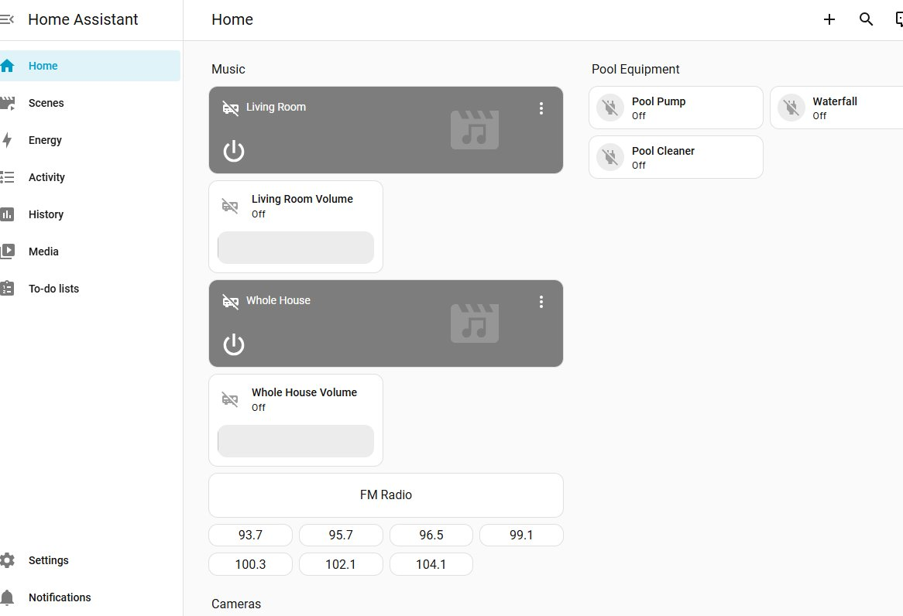

# From Pool Timers to a Full Smart Home Automation Platform in a Weekend
## Deploying Home Assistant on Hyper-V to Unify Pool Equipment, Multi-Zone Audio, and Security Cameras

I spent a weekend going down a rabbit hole that started with replacing three mechanical pool timers and ended with a fully custom smart home automation platform running on my home network — controlling pool equipment, a multi-zone audio system, four security cameras, and a home theater receiver, all from a single app. This is the story of how that happened, what worked, what didn't, and why I ended up building something I didn't plan to.

---

## The Problem

My pool equipment pad had three aging mechanical timers. They worked, but required manual adjustment for season changes, gave no remote visibility, and offered zero integration with anything else in the house.

The goal was simple: replace them with smart WiFi timers, set schedules remotely, and ideally bring them into a unified app alongside the cameras and audio system already in the house. What followed was anything but simple.

---

## Equipment Selected

After research, I purchased the following:

- **2× DEWENWILS Matter Smart WiFi Pool Timer (HOWT01J/HOWT01K)** — 240VAC, 40A, 3HP, Matter-enabled — for the pool pump and waterfall pump
- **1× DEWENWILS WiFi Pool Timer** — 120-277VAC universal voltage, 40A, 2HP — for the Polaris booster pump

The distinction between the two product lines matters for this article: the first two are **Matter-certified devices**, while the third is a standard **Smart Life/Tuya** platform device. As you will see, this distinction drove most of the complexity that followed.

---

## The Electrician Visit

The physical installation was straightforward — existing wiring stayed in place, new timer boxes mounted directly on the equipment pad wall. A GFCI outlet for the pool light was also inspected and resolved in the same visit.

**Practical tip**: Most Denon and other network-capable AV receivers expose a local web configuration interface accessible directly via their IP address (e.g., `http://192.168.x.x`). This is useful for configuration without relying on the manufacturer app — AirPlay, for example, is disabled by default and must be enabled here. More on this later.

All devices powered on manually — wiring confirmed good. The challenge was everything that came after.

---

## Matter: The Protocol That Promises Everything

Matter is the smart home industry's answer to fragmentation — a universal protocol backed by Apple, Google, Amazon, and Samsung that promises any device works with any platform. In practice, the experience was considerably more nuanced.

### Google Home: Offline After Every Commissioning Attempt

The two DEWENWILS Matter timers were commissioned through Google Home via QR code scan. Every time, the app confirmed successful setup. Every time, the devices showed as **offline** immediately afterward.

Several things are worth documenting for anyone hitting the same wall:

**Enable IPv6 on Google Nest WiFi.** This is disabled by default and Matter requires it. Go to Google Home → WiFi → Settings → Advanced Networking → turn on IPv6. In my case it was off by default. While enabling it alone did not resolve the offline issue, it is best practice and increasingly important as more IoT devices adopt IPv6. Enable it regardless.

**2.4GHz and iPhone Personal Hotspot.** These Matter timers are 2.4GHz only. On newer iPhones, go to Settings → Personal Hotspot → **Maximize Compatibility** to force the hotspot to 2.4GHz. This is a valid tip worth knowing for initial commissioning of any 2.4GHz-only device, even though it did not resolve the offline issue in this case.

**The real reason Google Home failed**: Google Home requires a dedicated **Matter Controller** device on the local network — a physical Google device such as a Nest Hub, Nest Mini, or Nest Audio — to maintain persistent communication with Matter devices. Without one, Google Home can commission a device and store its credentials, but cannot maintain an active local connection, resulting in a permanent offline state. This is a known and documented limitation of the Google Home ecosystem.

### Apple Home: Worked Immediately, No Hub Required

After resetting both devices, they were added to **Apple Home** using the same QR code scan. Both devices came online immediately and were fully controllable within seconds — no additional hub, no additional configuration.

**Why Apple Home worked without a hub while Google Home required one**: Starting with iOS 18, Apple removed the hub requirement for Matter-over-WiFi devices. The iPhone itself acts as the local Matter controller. Google Home does not have an equivalent capability on the mobile app and continues to require a dedicated hub device on the network.

**Practical takeaway**: If your Matter device shows offline in Google Home, try Apple Home first. If it works there, the device and your network are fine — the issue is Google Home's hub dependency. Amazon Alexa is also Matter-compatible but similarly requires an Echo device acting as a hub. Apple Home on iOS 18 is currently the only major platform that does not require additional hardware for Matter-over-WiFi devices.

### Matter Multi-Admin Fabric Sharing

Once both devices were working in Apple Home, they were shared to Google Home using Matter's multi-admin capability:

1. In Apple Home → tap the device → settings → **Turn on Pairing Mode** — generates a pairing code
2. In Google Home → Add device → Enter code manually → paste the pairing code

This allows multiple ecosystems to share control of the same physical device without resetting it. The process is not immediately intuitive but is fully supported by the Matter specification. Note that the app used for initial commissioning must remain installed — it is required to put the device into pairing mode for subsequent fabric sharing.

---

## Why Custom Automation: Home Assistant

With the devices working in Apple Home and the Smart Life app, the question became: how do you bring everything — pool equipment, audio system, cameras — into a single app with custom schedules and one-tap scenes?

The major vendor platforms each have hard limits:

- **Google Home**: Capable, but requires Google ecosystem hub devices; Matter devices require a controller; camera on/off via SDM API not supported
- **Apple Home**: Excellent Matter support on iOS 18, but remote access and automations require a HomePod or Apple TV hub; no native support for AV receivers or Tuya/Smart Life devices
- **Amazon Alexa**: Full-featured but requires an Echo device as a hub

None of these platforms could unify all devices into a single interface with custom logic — particularly the AV receiver with zone control and FM radio preset selection, which requires sending raw HTTP commands to the receiver's network interface. This is simply not possible within the automation models of any major vendor platform.

**[Home Assistant](https://www.home-assistant.io)** is an open-source local automation platform that runs on your own infrastructure. No vendor lock-in, no subscription required for local control, and an integration library covering thousands of devices. The decision to deploy it was straightforward once the limitations of the vendor platforms became clear.

---

## Deploying Home Assistant on Windows 11 via Hyper-V

Home Assistant OS is distributed as a virtual machine image with official Hyper-V support. Deployment took approximately 30 minutes.

### Prerequisites

- Windows 11 with Hyper-V enabled (Settings → Turn Windows features on or off → Hyper-V)
- PC connected via **Ethernet to your router** — critical, explained below
- 4GB RAM allocated to the VM

### Download

Download the latest Home Assistant OS `.vhdx` image from the official GitHub releases page:

**[https://github.com/home-assistant/operating-system/releases/latest](https://github.com/home-assistant/operating-system/releases/latest)**

Select `haos_ova-[version].vhdx.zip`, extract it, and retain the `.vhdx` file.

### Hyper-V VM Creation

1. Hyper-V Manager → Action → New → Virtual Machine
2. Generation: **Generation 2**
3. Memory: 4096 MB, disable Dynamic Memory
4. Network: assign the **External Switch** (created below)
5. Hard disk: Use an existing virtual hard disk → select the extracted `.vhdx`
6. Before starting: Settings → Security → **uncheck Secure Boot**

### The Network Switch — Why Ethernet Matters

Create an External Switch in Hyper-V Virtual Switch Manager, selecting your **Ethernet adapter** as the external network. Check "Allow management operating system to share this network adapter."

**Do not use the Default Switch.** The Default Switch places the VM on an isolated internal subnet (172.17.x.x) rather than your home network. The VM appears to work — Home Assistant loads locally — but it cannot discover or communicate with any devices on your LAN, and Matter commissioning will fail entirely because Matter relies on multicast networking that does not traverse NAT. With the External Switch bound to the Ethernet adapter, the VM receives a proper IP address in the same subnet as all other devices on your network.

**Assign a static IP** to the host PC in your router settings to ensure Home Assistant is always reachable at the same address after reboots.

Once the VM starts, the console displays the assigned IP and the Home Assistant URL:

```
Home Assistant URL: http://homeassistant.local:8123
```

---

## Integrations Deployed

### Matter Devices

Home Assistant includes native Matter support. After installing the Matter Server add-on via Settings → Add-ons:

Settings → Devices & Services → Add Integration → Matter → **Add shared device**

Use Apple Home's "Turn on Pairing Mode" to generate a pairing code, then enter it in Home Assistant. The devices join the existing Matter fabric without resetting. Both devices appeared as controllable switch entities immediately.

### Smart Life / Tuya

The Polaris timer uses the Smart Life/Tuya platform. Home Assistant includes a native Tuya integration — link your Smart Life account credentials and devices appear automatically.

### Denon AVR (HEOS / Denon AVR Network Receivers)

The Denon AVR-X1600H is supported natively via the **Denon AVR Network Receivers** integration. Home Assistant auto-discovered the receiver on the local network. In the integration options, enable **Zone 2** to expose both zones as separate media player entities — enabling independent volume and source control for the living room zone and the distributed whole-house speaker zone.

**Zone 2 and multi-room audio**: When Zone 2's source is set to **"Source"** mode, it follows whatever is playing in the main zone. This means AirPlay playback from any iOS app — Spotify, Pandora, SiriusXM, Apple Music — plays through all zones simultaneously via a single AirPlay selection on the iPhone. No separate app or routing configuration required.

### Google Nest Cameras (SDM API)

Integrating Google Nest cameras requires a one-time setup through the Google Device Access program. The steps involve:

1. Creating a Google Cloud project and enabling the Smart Device Management API and Cloud Pub/Sub API
2. Configuring an OAuth 2.0 client ID
3. Creating a Cloud Pub/Sub topic for event delivery
4. Registering a Device Access project at [console.nest.google.com/device-access](https://console.nest.google.com/device-access) — a one-time $5 USD fee applies
5. Completing the OAuth authorization flow in Home Assistant

The underlying concepts — OAuth client credentials, pub/sub event delivery, consent screens — are conceptually familiar for anyone who has worked with cloud APIs. The challenge is navigating multiple Google Cloud consoles across several steps without losing track of which project ID, client ID, and topic name belong together. Follow the [official Home Assistant Nest documentation](https://www.home-assistant.io/integrations/nest/) closely.

Once connected, all cameras appeared in Home Assistant with livestream and motion event entities.

---

## The Dashboard

Home Assistant's dashboard system uses YAML-based Lovelace configuration, giving complete control over layout, card types, and interactions. The result is a single interface covering all devices — something no single vendor platform could provide.



*The Home view in Home Assistant — Music section with zone controls, volume sliders, FM Radio source button, and direct station preset buttons; Pool Equipment section with pool pump, waterfall, and cleaner controls; Cameras section below. The mobile app provides the same interface in a touch-optimized layout.*

### Home View (Manual Control)

- **Music section**: Media control cards for both AVR zones (Living Room and Whole House) with independent volume sliders; FM Radio source button; direct station preset buttons
- **Pool Equipment section**: On/off tile cards for all three pool devices
- **Cameras section**: Live picture-glance cards for all four cameras

### Scenes View (One-Tap Scenarios)

Scenes are implemented as **Scripts** in Home Assistant — sequences of actions that execute in order with configurable delays. This is important: unlike the scene primitives in Google Home or Apple Home which capture static device states, Home Assistant scripts execute dynamic sequences, making them suitable for multi-device workflows that require ordering and timing.

Example scenes configured:

- **Get in Pool**: Powers on pool equipment and starts audio across all zones
- **Get Out of Pool**: Powers off pool equipment and all audio
- **Music On — All Zones**: Powers on the AVR, enables Zone 2 in Source mode (so it follows the main zone), and starts FM radio — the same music plays throughout the house including outdoor areas
- **Music Off**: Powers off both audio zones
- **All Off**: Powers off all pool equipment and all audio in a single tap

---

## Custom FM Radio Preset Control — A Concrete Example of Why Custom Automation Wins

The Denon AVR-X1600H has a built-in FM tuner. After running an auto-preset scan across local stations, the goal was to put direct-access buttons for favorite stations on the dashboard — tap once, that station plays immediately.

Home Assistant's Denon integration exposes a `denonavr.get_command` action that sends raw HTTP commands directly to the receiver's local network interface. Switching to the FM tuner source:

```
/goform/formiPhoneAppDirect.xml?SITUNER
```

Jumping directly to a saved preset:

```
/goform/formiPhoneAppDirect.xml?TPAN06
```

Each station button on the dashboard calls this action with its corresponding preset number. One tap — that station plays.

This capability is not available in Google Home, Apple Home, or Amazon Alexa. Those platforms surface only the device capabilities their integration providers choose to expose. Home Assistant gives direct access to the device's native network API — any capability the device exposes locally is controllable. The same principle applies to Zone 2 source switching, power-on sequencing with delays between steps, and any workflow that requires interacting with device internals rather than just on/off state.

---

## Scheduling and Automation

Home Assistant supports time-based triggers, state-based triggers, and condition logic as first-class automation capabilities. Pool equipment, audio zones, or any connected device can be scheduled to turn on and off on any recurring pattern — daily, day-of-week, seasonal, or based on sunrise/sunset offsets.

Automations are defined in YAML and managed through the Home Assistant UI or directly in configuration files. They are idempotent by default — sending a "turn on" command to a device already on produces no adverse effect, so manual overrides via the dashboard do not conflict with scheduled automations.

The scheduling capability alone — applied to pool equipment, irrigation, lighting, or any IP-connected device — represents significant value that previously required either proprietary smart timers with limited app support or expensive dedicated controllers.

---

## Limitations and Honest Observations

**Camera on/off via automation**: Not supported through the Google SDM API. Cameras can be viewed in Home Assistant but cannot be toggled on or off programmatically. This is a confirmed API limitation, not a Home Assistant limitation.

**Remote access outside the home network**: Home Assistant runs locally. Remote access requires either [Nabu Casa](https://www.nabucasa.com) (the official Home Assistant cloud relay at $7/month) or a self-hosted solution. This has not yet been configured — the security implications of exposing a home automation server externally warrant assessment before enabling. Nabu Casa is the recommended path for most users as it handles the secure tunnel without requiring port forwarding or a VPN.

**Google Home Matter without a hub**: Matter devices will commission successfully in Google Home but remain permanently offline without a dedicated Matter Controller (Nest Hub, Nest Mini, etc.) on the network. This is a Google Home architectural requirement, not a device or network issue.

**Initial device app dependency**: Smart Life/Tuya devices require their native app for initial commissioning and the app must remain installed. Matter devices require their commissioning app to generate pairing mode codes for multi-admin fabric sharing. Neither process is particularly intuitive on first encounter, but both are well-documented and fully supported.

---

## What's Next

**Energy Monitoring**: Home Assistant supports integrations for utility grid data and real-time electricity pricing. For time-of-use rate plan subscribers, this opens the possibility of automating equipment to run during off-peak pricing windows — a meaningful saving when applied to devices that run for hours daily. Grid carbon intensity monitoring is also available, enabling automation decisions based on how cleanly the grid is running at any given time.

**Voice-Activated Scenes**: Home Assistant supports voice assistant integration which would allow scenes to be triggered by voice — "turn on pool mode" activating the full Get in Pool script. This has not yet been configured but is a natural extension of the existing scene architecture.

**Extensibility**: The platform is open-ended. Any IP-connected device with a Home Assistant integration — thermostats, irrigation controllers, EV chargers, door locks, lighting systems — can be added to the same platform and brought into the same dashboard and automation engine without architectural changes.

---

## Credits and Resources

- **Home Assistant**: [https://www.home-assistant.io](https://www.home-assistant.io)
- **Home Assistant OS GitHub Releases**: [https://github.com/home-assistant/operating-system/releases](https://github.com/home-assistant/operating-system/releases)
- **Home Assistant Nest Integration**: [https://www.home-assistant.io/integrations/nest/](https://www.home-assistant.io/integrations/nest/)
- **Home Assistant Denon AVR Integration**: [https://www.home-assistant.io/integrations/denonavr/](https://www.home-assistant.io/integrations/denonavr/)
- **Google Device Access Console**: [https://console.nest.google.com/device-access](https://console.nest.google.com/device-access)
- **Nabu Casa (Remote Access)**: [https://www.nabucasa.com](https://www.nabucasa.com)

The YAML configurations for dashboards, automations, and scripts referenced in this article were generated with assistance from an LLM during implementation. The platform generates syntactically correct YAML against a known schema, which significantly accelerates iterative dashboard development and multi-step script authoring. The conceptual design, device selection, infrastructure decisions, and all hands-on troubleshooting were done directly.
